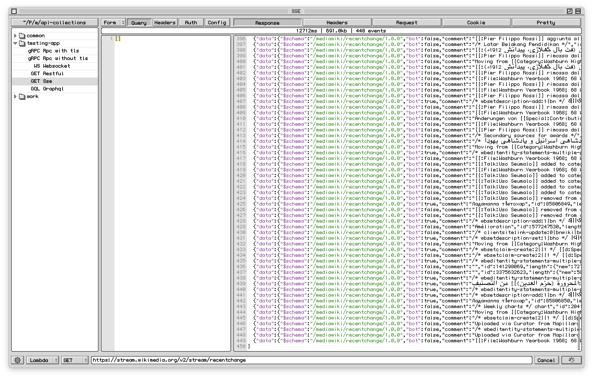
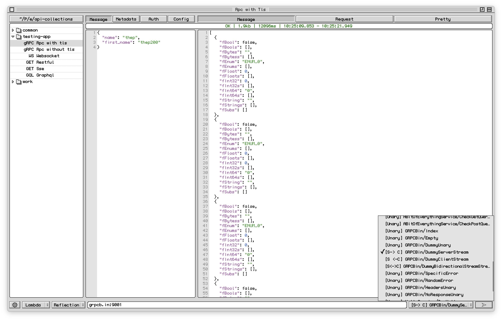
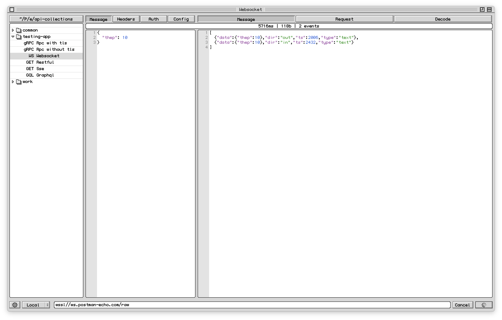
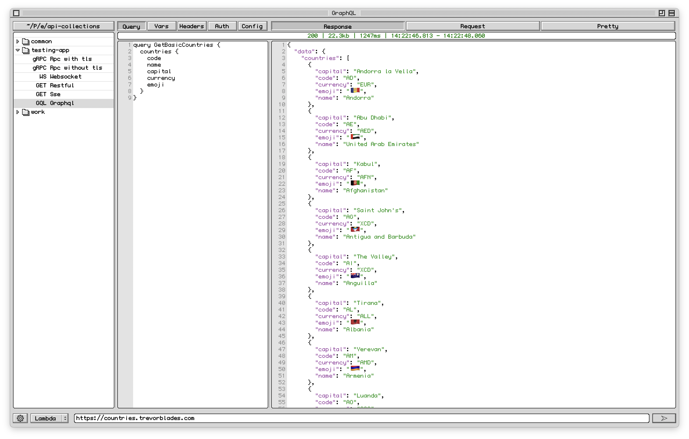

<h1 align="center">Deed ✨</h1>
<p align="center"> A lightweight, native macOS API client in retro Mac OS 9 style that speaks REST/HTTP, SSE, gRPC, WebSocket, GraphQL, and Kafka from a single <=50 MB binary. </p>


- [Overview](#overview)
- [Installation](#installation)
- [Features](#features)
- [Techstack](#techstack)
- [Configuration](#configuration)
  - [Global config](#global-config)
  - [Environments](#environments)
- [Request type](#request-type)
  - [How a send works](#how-a-send-works)
  - [Config](#config)
  - [RESTFUL HTTP](#restful-http)
    - [Request Body](#request-body)
    - [Request Headers](#request-headers)
    - [Request Query](#request-query)
    - [Request Auth](#request-auth)
    - [Response Body](#response-body)
    - [Response Headers](#response-headers)
    - [Response Request](#response-request)
  - [SSE](#sse)
  - [gRPC](#grpc)
  - [Websocket](#websocket)
  - [GraphQL](#graphql)
  - [Kafka](#kafka)
    - [Producer](#producer)
    - [Consumer](#consumer)
- [Releases](#releases)

# Overview

Supports:

- RESTFUL / HTTP
- SSE
- gRPC (unary, server-streaming, client-streaming, bidi)
- WebSocket
- GraphQL (query, mutation, subscription)
- Kafka (producer & consumer)

# Installation

Currently, I'm still shipping deed files as `.app`. Please download the latest version from the release section to use it. Features for upgrading the app and shipping `.dmg` files will be implemented soon.

# Features

- Light weight
  - Single binary
  - App size <50MB
  - Runtime memory <150MB for normal usage
- Vintage theme MacOS 9 style
- RESTFUL / HTTP
- SSE
- gRPC
- WebSocket
- GraphQL
- Kafka
- Lazy load collection tree
- Request editor (JSON)
- Response viewer (JSON)
- Environment & Alias
- Import curl, gRPC

# Techstack

- C++17 (cross-platform)
- Objective-C++ / AppKit
- Scintilla
- libcurl/cpr
- gRPC C++ + Protobuf
- nlohmann/json
- CMake + Ninja

# Configuration

## Global config

```json
{
  "font_name": "Monaco 9",
  "font_size": 21,
  "ram_cache_size": 32,
  "disk_cache_size": 256
}
```

Deed caches responses in two tiers, RAM and disk:

* The RAM cache can be set up to **128 MB**.
* The disk cache can be set up to **512 MB**.

`ram_cache_size` and `disk_cache_size` are the levels you choose; anything higher than the limits above is capped automatically.

## Environments

There are no global environments yet — it may be added later. When you import a cURL or gRPC command, Deed automatically creates the matching aliases for you.

Use `{{key}}` anywhere a value is accepted (URL, headers, query, auth, gRPC metadata, …) to insert an environment value. If a key doesn't exist it's left as-is (`{{key}}`) and flagged; if it exists but is empty it becomes an empty string.

An environment file is just a list of keys:

```json
{
  "schemaVersion": 1,
  "keys": [
    {
      "key": "baseUrl",
      "value": "https://api.example.com",
      "enabled": 1
    },
    {
      "key": "token",
      "value": "eyJhbGciOiJI...",
      "enabled": 1
    }
  ]
}
```

> **NOTE:** Secrets are **not** encrypted yet, so double-check your environment files before syncing them to GitHub.

# Request type

Give the app 30 minutes hands-on and this will all click — but here's the reference.

Each request has editing tabs on the **left** and a read-only response on the **right**. Whatever you fill into the tabs is saved to one small JSON file per request, so you can keep an entire collection in a folder and sync it with git.

> Files don't support comments. To turn a single line in **Headers**, **Query**, or **Metadata** on or off, set its `enabled` to `0` instead of deleting it.

## How a send works

Every request type follows the same path when you press **Send**:

1. Deed reads the URL field and the left-hand tabs (bad JSON in a tab shows a toast and jumps you to the offending tab — nothing is sent).
2. Every `{{key}}` is replaced with its value from the active environment.
3. Auth is applied and disabled lines are dropped.
4. The request goes out on a background worker, so the UI never freezes and you can keep browsing the collection.

What comes back depends on the request's shape:

- **One-shot requests** (HTTP, GraphQL query/mutation, gRPC unary & client-streaming, Kafka producer) show a single response on the right, plus status, elapsed time, and size in the status bar.
- **Streaming requests** (SSE, gRPC server-streaming/bidi, WebSocket, GraphQL subscription, Kafka consumer) open a live session: each incoming message is appended to the right pane as it arrives, with running counters for elapsed / events / size. The session stays open until the server ends it or you press **Cancel** (for WebSocket that's a polite disconnect).

Responses are also cached (RAM + disk, see [Global config](#global-config)), so reopening a request shows its last response instantly — even after an app restart.

## Config

The **Config** tab (the last left-hand tab, on every request type) holds two settings shared by all types:

```json
{
  "timeout_ms": 1800000,
  "tls": true
}
```

- `timeout_ms` — how long to wait before giving up. For HTTP/GraphQL it's the request timeout, for gRPC the deadline, for WebSocket the idle timeout. For a Kafka producer the effective delivery timeout is the **smaller** of this and the Kafka tab's `messageTimeoutMs`.
- `tls` — verify the server's TLS certificate (for gRPC, connect over a secure channel). The Kafka Config tab only has `timeout_ms` (no TLS toggle yet).

New requests start with the defaults from `.env` (`DEFAULT_TIMEOUT_MS`, `VERIFY_TLS`) — 30 minutes and TLS verification on, out of the box.

> The **Pretty** button has four modes — **Pretty / Raw / Encode / Decode**. Click into the pane you want it to act on first, then press it.

## RESTFUL HTTP

Paste a `curl` command straight into the URL field and Deed turns it into a new request automatically.

### Request Body

The **Body** tab button is a dropdown — click it to pick one of five modes: **JSON**, **Text**, **XML**, **File**, or **Form**. One mode is active at a time, and switching modes keeps what you typed in each as a draft, so you can flip back and forth without losing anything.

JSON (default; `{}` = no body):

```json
{
  "name": "deed"
}
```

Text / XML — sent verbatim, exactly as typed.

Form (URL-encoded):

```json
[
  {
    "key": "",
    "value": "",
    "enabled": true
  }
]
```

File - Binary:

```json
{
  "filePath": "/thep200/deed/foo.bin"
}
```

### Request Headers

The **Headers** tab is a list of key/value lines. Duplicate keys are allowed. Set `enabled` to `0` to keep a line but skip sending it.

```json
[
  {
    "key": "Content-Type",
    "value": "application/json",
    "enabled": 1
  },
  {
    "key": "X-Debug",
    "value": "1",
    "enabled": 0
  }
]
```

### Request Query

Deed auto parse and cut query in URL into tab for you.

URL: localhost:8080/api/products?limit=1000

```json
[
  {
    "enabled": 1,
    "key": "limit",
    "value": "1000"
  }
]
```

### Request Auth

The **Auth** tab offers four types: **None**, **Basic**, **Bearer**, and **API key**.

None:

```json
{
  "type": "none"
}
```

Basic — username and password:

```json
{
  "type": "basic",
  "basic": {
    "username": "admin",
    "password": "s3cret"
  }
}
```

Bearer — a token:

```json
{
  "type": "bearer",
  "bearer": {
    "token": "{{token}}"
  }
}
```

API key, sent as a header (`in` = `"header"`):

```json
{
  "type": "apikey",
  "apikey": {
    "key": "X-API-Key",
    "value": "{{apiKey}}",
    "in": "header"
  }
}
```

### Response Body

The **Response** tab (read-only) shows the response body, pretty-printed when it's JSON.

### Response Headers

The right-hand **Headers** tab (read-only) lists the response headers exactly as the server returned them. Any `Set-Cookie` values also appear in the **Cookie** tab.

### Response Request

The right-hand **Request** tab (read-only) shows the exact request that was sent — after variables are substituted, auth is applied, and disabled lines are removed. Handy for checking what the server actually received.

## SSE

Server-Sent Events is simply an HTTP request that streams. Add an `Accept: text/event-stream` header (enabled) to a plain HTTP request and Deed does the rest: instead of waiting for one response, the right pane turns into a live event log and each `data:` payload is appended as it arrives. Press **Cancel** to stop listening.



## gRPC

**URL field** — the target as `host:port` (no scheme), e.g. `localhost:8765`. Whether the channel is plaintext or TLS follows the `tls` flag in the **Config** tab.

**Picking the RPC** — Deed needs the schema to encode your message. Two sources, chosen with the proto dropdown next to the URL:

- **Reflection** (default) — the server must have gRPC reflection enabled. Click the method dropdown and Deed queries the server and lists every `service/method` it exposes; pick one.
- **.proto** — no reflection? Choose `.proto` and a file picker opens; point it at your local `.proto` file and Deed parses the services out of it instead.

**Tabs:**

- **Message** — the request message as JSON (field names as in the `.proto`). For **client-streaming / bidi** methods, put a JSON **array** here — each element is sent as one message, e.g. `[{"n": 1}, {"n": 2}, {"n": 3}]`.
- **Metadata** — key/value lines sent as gRPC metadata, same format as HTTP headers (`enabled: 0` to skip a line).
- **Config** — `timeout_ms` is the gRPC deadline; `tls` picks secure vs plaintext channel.

**Responses** — unary and client-streaming show one JSON response. Server-streaming and bidi stream into the right pane message by message; press **Cancel** to hang up. Very long streams are truncated for safety after 100k events or 64 MB (tunable in `.env`: `STREAM_MAX_EVENTS`, `STREAM_MAX_BYTES_MB`).

You can also paste a `grpcurl` command into the URL field and Deed imports it as a new request.



## Websocket

**URL field** — a `ws://` or `wss://` endpoint.

**Tabs:**

- **Message** — the frame to send. If it's non-empty it is sent automatically right after connecting; after that, edit it and press **Send** again to push the current text as a new frame through the open session — as many times as you like.
- **Headers** — extra handshake headers (the HTTP upgrade request).
- **Auth** — applied to the handshake, same four types as HTTP.

**Session** — pressing **Send** connects. The right pane logs every frame in and out, live. **Cancel** performs a graceful disconnect (close code 1000). Deed keeps the connection healthy with automatic keepalive pings and closes it if the server goes silent too long (tunable in `.env`: `WS_PING_INTERVAL_MS`, `WS_IDLE_TIMEOUT_MS`, …).



## GraphQL

**URL field** — the HTTP endpoint (e.g. `https://api.example.com/graphql`).

**Tabs:**

- **Query** — the GraphQL document (`query { … }`, `mutation { … }`, or `subscription { … }`).
- **Variables** — the variables object as JSON, e.g. `{"id": 42}`.
- **Headers / Auth** — same as HTTP.

Queries and mutations are sent over HTTP and show one response. A **subscription** runs over WebSocket using the `graphql-transport-ws` protocol (the legacy `subscriptions-transport-ws` is also supported) and streams events into the right pane until you press **Cancel** — set `"subTransport": "ws"` in the saved request file to switch the transport over.

Deed haven't supported instrospect yet.



## Kafka

**URL field** — the bootstrap servers, comma-separated `host:port` pairs, e.g. `localhost:9092` or `broker1:9092,broker2:9092`.

A **Prod / Cons** toggle next to the URL switches the request between producer and consumer — each side keeps its own tabs.

### Producer

- **Message** tab:

  ```json
  {
    "key": "user-42",
    "value": { "name": "deed" },
    "tombstone": false,
    "headers": []
  }
  ```

  - `key` — optional message key (empty = no key; Kafka then picks the partition round-robin).
  - `value` — the payload, written as real JSON right in the editor.
  - `tombstone` — set to `true` to send a **null value** (key + headers only). On a log-compacted topic this deletes the key. Needs a `key` to make sense.
  - `headers` — key/value lines, same format as HTTP headers.

- **Kafka** tab — the producer settings:

  ```json
  {
    "topic": "events",
    "partition": -1,
    "acks": "all",
    "compression": "none",
    "messageTimeoutMs": 30000,
    "lingerMs": 0,
    "retries": 3,
    "idempotence": false,
    "clientId": "deed",
    "extra": []
  }
  ```

- `partition: -1` lets Kafka choose.
- `acks` is `"0"` / `"1"` / `"all"`. 
- `compression` is `none/gzip/snappy/lz4/zstd`.
- `extra` passes any raw librdkafka property as key/value lines.

**Send** produces one message and shows a single delivery report (topic / partition / offset / latency). **Cancel** aborts a delivery that's stuck on an unreachable broker.

### Consumer

One **Kafka** tab:

```json
{
  "topics": ["events"],
  "group": "",
  "offsetReset": "latest",
  "partition": -1,
  "autoCommit": true,
  "maxMessages": null,
  "pollTimeoutMs": 500,
  "clientId": "deed",
  "extra": []
}
```

- `group` — consumer group id. **Leave it empty** and Deed generates a fresh `deed-tail-…` group per run, so `offsetReset` always applies.
- `offsetReset` — `"latest"` (default) tails only new messages; `"earliest"` reads the topic **from the beginning**. Note Kafka semantics: this only applies when the group has no committed offsets — another reason to leave `group` empty.
- `partition` — `-1` subscribes to all partitions; a number ≥ 0 pins to that one partition.
- `maxMessages` — `null` tails forever; a number stops after N records.

**Send** starts tailing: records stream into the right pane live (topic, partition, offset, key, value, headers, timestamp). Press **Cancel** to stop.

# Releases

The asset is `deed-<version>-macos-arm64.zip`.

The app is **ad-hoc signed** (not notarized with a Developer ID), so on first launch
macOS Gatekeeper blocks it. To open it:

* Right-click the app → **Open** → **Open**, or
* Remove the quarantine flag: `xattr -dr com.apple.quarantine /Applications/deed.app`
