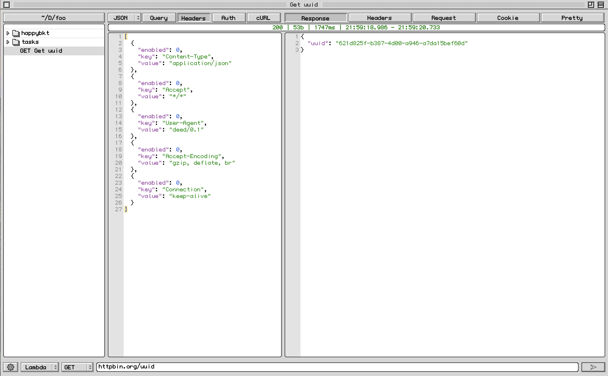

<h1 align="center">Deed</h1>

<h1 align="center">Deed is MacOS native API client</h1>

Supported type of request:

- REST/HTTP
- gRPC (unary)

# Features

- Light weight
- Theme retro MacOS
- REST / HTTP
- gRPC (unary)
- Collection tree (lazy load)
- Request editor (JSON)
- Response viewer (JSON)
- Environment & Alias
- Import curl

# Techstack

- C++17 (cross-platform)
- Objective-C++ / AppKit
- Scintilla
- libcurl/cpr
- gRPC C++ + Protobuf
- nlohmann/json
- CMake + Ninja

# Upcomming features

- Search & filter
- gRPC streaming
